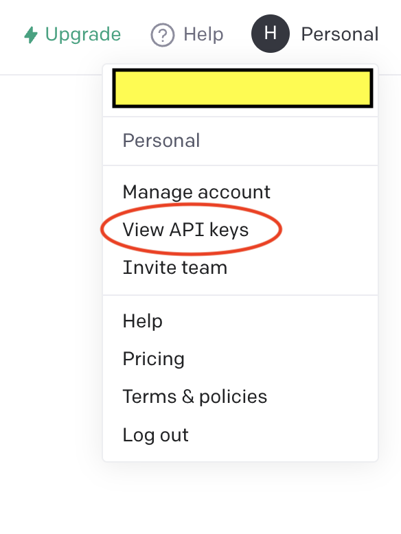
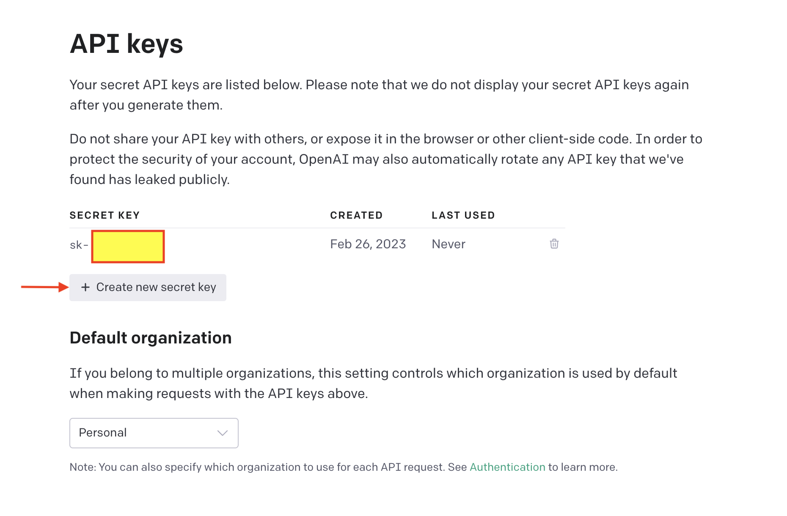
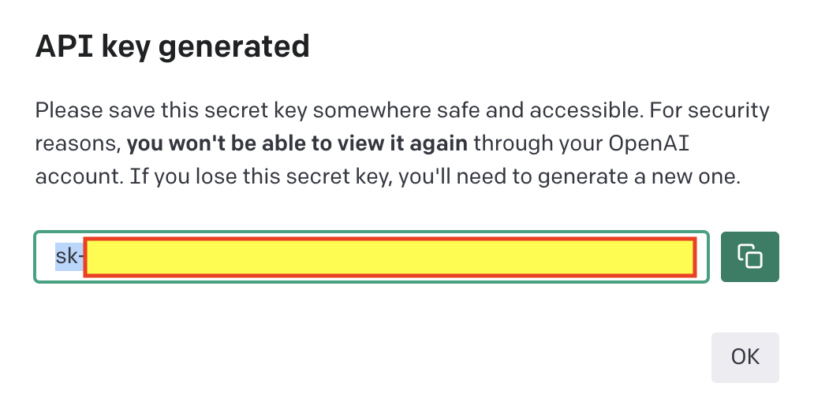

Intermediate API in R
================
Hedia Tnani

# Intermediate API in R

## 1. Basic API in R

Lat time we saw how to make a `GET` request to retrieve data from an
API. We’ll remember again the different steps. We’ll also add query
parameters and authentication.

Let’s remember what we did last time using the Ensembl Rest API.

First we prepare the URL.

``` r
library(httr) # accessing APIs
# Preparing the URL 
baseURL <- "https://rest.ensembl.org"
ext <- "/regulatory/species/homo_sapiens/microarray?"
URL <- modify_url(baseURL, path = ext)
```

As we saw last time a **Uniform Resource Identifier (URI)** **resource**
specifies which resource you want to access. A URI is a generalization
of a URL (Uniform Resource Locator)—what you commonly think of as "web
addresses".

Then we query the database.

``` r
response = GET(URL)
response
```

    Response [https://rest.ensembl.org/regulatory/species/homo_sapiens/microarray]
      Date: 2023-03-16 20:41
      Status: 200
      Content-Type: application/json
      Size: 3.46 kB

Then we convert the JSON format to a dataframe by using the `fromJSON`
function.

``` r
library(jsonlite)
fromJSON(content(response,as = "text", encoding = "UTF-8" ))
```

                         description   vendor  type      format
    1                           <NA>  PHALANX OLIGO  EXPRESSION
    2                           <NA> CODELINK OLIGO  EXPRESSION
    3                           <NA> ILLUMINA OLIGO  EXPRESSION
    4                           <NA>  AGILENT OLIGO  EXPRESSION
    5                           <NA> ILLUMINA OLIGO METHYLATION
    6                           <NA> ILLUMINA OLIGO  EXPRESSION
    7                           <NA>  AGILENT OLIGO  EXPRESSION
    8                           <NA>  AGILENT OLIGO         CGH
    9                           <NA>  AGILENT OLIGO  EXPRESSION
    10                          <NA>     AFFY OLIGO  EXPRESSION
    11                          <NA>  AGILENT OLIGO  EXPRESSION
    12                          <NA>     AFFY OLIGO  EXPRESSION
    13                          <NA>  AGILENT OLIGO  EXPRESSION
    14                          <NA>  AGILENT OLIGO  EXPRESSION
    15                          <NA>  AGILENT OLIGO  EXPRESSION
    16                          <NA>     AFFY OLIGO  EXPRESSION
    17                          <NA>  AGILENT OLIGO  EXPRESSION
    18                          <NA> ILLUMINA OLIGO METHYLATION
    19                          <NA>     AFFY OLIGO  EXPRESSION
    20 Human Transcriptome Array 2.0     AFFY OLIGO  EXPRESSION
    21                          <NA>     AFFY OLIGO  EXPRESSION
    22                          <NA>     AFFY OLIGO  EXPRESSION
    23                          <NA>     AFFY OLIGO  EXPRESSION
    24                          <NA>     AFFY OLIGO  EXPRESSION
    25                          <NA>     AFFY OLIGO  EXPRESSION
    26                          <NA>     AFFY OLIGO  EXPRESSION
    27                          <NA>     AFFY OLIGO  EXPRESSION
    28                          <NA>     AFFY OLIGO  EXPRESSION
    29                          <NA>     AFFY OLIGO  EXPRESSION
    30                          <NA>     AFFY OLIGO  EXPRESSION
    31                          <NA>     AFFY OLIGO  EXPRESSION
    32                          <NA>     AFFY OLIGO  EXPRESSION
    33                          <NA>     AFFY OLIGO  EXPRESSION
    34                          <NA>     AFFY OLIGO  EXPRESSION
    35                          <NA>     AFFY OLIGO  EXPRESSION
                          array
    1                  OneArray
    2                  CODELINK
    3              HumanWG_6_V3
    4                   GPL6848
    5       HumanMethylation450
    6             HumanRef-8_V3
    7               WholeGenome
    8                   CGH_44b
    9     SurePrint_G3_GE_8x60k
    10                  HC-G110
    11 SurePrint_G3_GE_8x60k_v2
    12                 HG-Focus
    13     WholeGenome_4x44k_v1
    14     WholeGenome_4x44k_v2
    15                 GPL26966
    16               HG-U133A_2
    17                 GPL19072
    18       HumanMethylation27
    19                 HG-U133B
    20                  HTA-2_0
    21           HG-U133_Plus_2
    22                HG_U95Av2
    23                  HG-U95B
    24                  HG-U95C
    25                  HG-U95D
    26                  HG-U95E
    27                  HG_U95A
    28                 HuGeneFL
    29                 U133_X3P
    30                PrimeView
    31       HT_HG-U133_Plus_PM
    32           HuEx-1_0-st-v2
    33         HuGene-2_0-st-v1
    34         HuGene-1_0-st-v1
    35         HuGene-2_1-st-v1

Then we saw how to make a function.

``` r
library(httr)
library(jsonlite)

get_microarrays <- function(baseURL, ext, content_type){

    r <- GET(paste(baseURL, ext, sep = ""), accept(content_type))

    stop_for_status(r)

    if (content_type == 'application/json'){
        return (fromJSON(content(r, "text", encoding = "UTF-8")))
    } else {
        return (content(r, "text", encoding = "UTF-8"))
    }
}

baseURL <- "https://rest.ensembl.org"
ext <- "/regulatory/species/homo_sapiens/microarray?"
con <- "application/json"


get_microarrays(baseURL, ext, con)
```

                         description      format   vendor  type
    1                           <NA>  EXPRESSION  PHALANX OLIGO
    2                           <NA>  EXPRESSION CODELINK OLIGO
    3                           <NA>  EXPRESSION ILLUMINA OLIGO
    4                           <NA>  EXPRESSION  AGILENT OLIGO
    5                           <NA> METHYLATION ILLUMINA OLIGO
    6                           <NA>  EXPRESSION ILLUMINA OLIGO
    7                           <NA>  EXPRESSION  AGILENT OLIGO
    8                           <NA>         CGH  AGILENT OLIGO
    9                           <NA>  EXPRESSION  AGILENT OLIGO
    10                          <NA>  EXPRESSION     AFFY OLIGO
    11                          <NA>  EXPRESSION  AGILENT OLIGO
    12                          <NA>  EXPRESSION     AFFY OLIGO
    13                          <NA>  EXPRESSION  AGILENT OLIGO
    14                          <NA>  EXPRESSION  AGILENT OLIGO
    15                          <NA>  EXPRESSION  AGILENT OLIGO
    16                          <NA>  EXPRESSION     AFFY OLIGO
    17                          <NA>  EXPRESSION  AGILENT OLIGO
    18                          <NA> METHYLATION ILLUMINA OLIGO
    19                          <NA>  EXPRESSION     AFFY OLIGO
    20 Human Transcriptome Array 2.0  EXPRESSION     AFFY OLIGO
    21                          <NA>  EXPRESSION     AFFY OLIGO
    22                          <NA>  EXPRESSION     AFFY OLIGO
    23                          <NA>  EXPRESSION     AFFY OLIGO
    24                          <NA>  EXPRESSION     AFFY OLIGO
    25                          <NA>  EXPRESSION     AFFY OLIGO
    26                          <NA>  EXPRESSION     AFFY OLIGO
    27                          <NA>  EXPRESSION     AFFY OLIGO
    28                          <NA>  EXPRESSION     AFFY OLIGO
    29                          <NA>  EXPRESSION     AFFY OLIGO
    30                          <NA>  EXPRESSION     AFFY OLIGO
    31                          <NA>  EXPRESSION     AFFY OLIGO
    32                          <NA>  EXPRESSION     AFFY OLIGO
    33                          <NA>  EXPRESSION     AFFY OLIGO
    34                          <NA>  EXPRESSION     AFFY OLIGO
    35                          <NA>  EXPRESSION     AFFY OLIGO
                          array
    1                  OneArray
    2                  CODELINK
    3              HumanWG_6_V3
    4                   GPL6848
    5       HumanMethylation450
    6             HumanRef-8_V3
    7               WholeGenome
    8                   CGH_44b
    9     SurePrint_G3_GE_8x60k
    10                  HC-G110
    11 SurePrint_G3_GE_8x60k_v2
    12                 HG-Focus
    13     WholeGenome_4x44k_v1
    14     WholeGenome_4x44k_v2
    15                 GPL26966
    16               HG-U133A_2
    17                 GPL19072
    18       HumanMethylation27
    19                 HG-U133B
    20                  HTA-2_0
    21           HG-U133_Plus_2
    22                HG_U95Av2
    23                  HG-U95B
    24                  HG-U95C
    25                  HG-U95D
    26                  HG-U95E
    27                  HG_U95A
    28                 HuGeneFL
    29                 U133_X3P
    30                PrimeView
    31       HT_HG-U133_Plus_PM
    32           HuEx-1_0-st-v2
    33         HuGene-2_0-st-v1
    34         HuGene-1_0-st-v1
    35         HuGene-2_1-st-v1

## 2. Intermediate API in R

### **2.1. Adding Query Parameters**

What if we need to add query parameters ?

Query parameters are the extra **parameters** (arguments) about what
resource to access.

We can pass `query` parameters as a named list, where the names are the
`API` fields for each query parameter.

We can use the `query` parameter of the **`GET()` function** from the
`httr` package to add the query parameters to our request.

So let’s edit the previous `get_microarrays()` function.

-   Add a **new parameter** named `queries` to the function and assign
    `list()` to it to make it an optional parameter: `queries = list()`.
    We assign a `list()` here so that multiple optional parameters can
    be passed to our function.

-   Edit the `GET()` function to set its `query` parameter to our
    function parameter `queries`.

Let’s take again the same example using the Ensembl rest API.

``` r
library(httr)
library(jsonlite)

get_microarrays <- function(baseURL, endpoint, queries){

    r <- GET(paste(baseURL, endpoint, sep = ""), queries)

    stop_for_status(r)

    return (content(r, "text", encoding = "UTF-8"))
    }

baseURL <- "https://rest.ensembl.org"
endpoint <- "/regulatory/species/homo_sapiens/microarray?"
queries = list(format="json")


get_microarrays(baseURL, endpoint, queries)
```

    [1] "[{\"vendor\":\"PHALANX\",\"type\":\"OLIGO\",\"format\":\"EXPRESSION\",\"array\":\"OneArray\",\"description\":null},{\"array\":\"CODELINK\",\"description\":null,\"format\":\"EXPRESSION\",\"type\":\"OLIGO\",\"vendor\":\"CODELINK\"},{\"format\":\"EXPRESSION\",\"description\":null,\"array\":\"HumanWG_6_V3\",\"vendor\":\"ILLUMINA\",\"type\":\"OLIGO\"},{\"format\":\"EXPRESSION\",\"description\":null,\"array\":\"GPL6848\",\"type\":\"OLIGO\",\"vendor\":\"AGILENT\"},{\"vendor\":\"ILLUMINA\",\"type\":\"OLIGO\",\"format\":\"METHYLATION\",\"array\":\"HumanMethylation450\",\"description\":null},{\"description\":null,\"array\":\"HumanRef-8_V3\",\"format\":\"EXPRESSION\",\"vendor\":\"ILLUMINA\",\"type\":\"OLIGO\"},{\"type\":\"OLIGO\",\"vendor\":\"AGILENT\",\"format\":\"EXPRESSION\",\"array\":\"WholeGenome\",\"description\":null},{\"type\":\"OLIGO\",\"vendor\":\"AGILENT\",\"format\":\"CGH\",\"array\":\"CGH_44b\",\"description\":null},{\"description\":null,\"array\":\"SurePrint_G3_GE_8x60k\",\"format\":\"EXPRESSION\",\"type\":\"OLIGO\",\"vendor\":\"AGILENT\"},{\"format\":\"EXPRESSION\",\"array\":\"HC-G110\",\"description\":null,\"vendor\":\"AFFY\",\"type\":\"OLIGO\"},{\"vendor\":\"AGILENT\",\"type\":\"OLIGO\",\"description\":null,\"array\":\"SurePrint_G3_GE_8x60k_v2\",\"format\":\"EXPRESSION\"},{\"description\":null,\"array\":\"HG-Focus\",\"format\":\"EXPRESSION\",\"vendor\":\"AFFY\",\"type\":\"OLIGO\"},{\"format\":\"EXPRESSION\",\"array\":\"WholeGenome_4x44k_v1\",\"description\":null,\"vendor\":\"AGILENT\",\"type\":\"OLIGO\"},{\"format\":\"EXPRESSION\",\"array\":\"WholeGenome_4x44k_v2\",\"description\":null,\"type\":\"OLIGO\",\"vendor\":\"AGILENT\"},{\"array\":\"GPL26966\",\"description\":null,\"format\":\"EXPRESSION\",\"vendor\":\"AGILENT\",\"type\":\"OLIGO\"},{\"vendor\":\"AFFY\",\"type\":\"OLIGO\",\"format\":\"EXPRESSION\",\"description\":null,\"array\":\"HG-U133A_2\"},{\"array\":\"GPL19072\",\"description\":null,\"format\":\"EXPRESSION\",\"type\":\"OLIGO\",\"vendor\":\"AGILENT\"},{\"vendor\":\"ILLUMINA\",\"type\":\"OLIGO\",\"format\":\"METHYLATION\",\"array\":\"HumanMethylation27\",\"description\":null},{\"description\":null,\"array\":\"HG-U133B\",\"format\":\"EXPRESSION\",\"vendor\":\"AFFY\",\"type\":\"OLIGO\"},{\"vendor\":\"AFFY\",\"type\":\"OLIGO\",\"format\":\"EXPRESSION\",\"array\":\"HTA-2_0\",\"description\":\"Human Transcriptome Array 2.0\"},{\"vendor\":\"AFFY\",\"type\":\"OLIGO\",\"description\":null,\"array\":\"HG-U133_Plus_2\",\"format\":\"EXPRESSION\"},{\"format\":\"EXPRESSION\",\"array\":\"HG_U95Av2\",\"description\":null,\"type\":\"OLIGO\",\"vendor\":\"AFFY\"},{\"vendor\":\"AFFY\",\"type\":\"OLIGO\",\"array\":\"HG-U95B\",\"description\":null,\"format\":\"EXPRESSION\"},{\"type\":\"OLIGO\",\"vendor\":\"AFFY\",\"description\":null,\"array\":\"HG-U95C\",\"format\":\"EXPRESSION\"},{\"array\":\"HG-U95D\",\"description\":null,\"format\":\"EXPRESSION\",\"type\":\"OLIGO\",\"vendor\":\"AFFY\"},{\"type\":\"OLIGO\",\"vendor\":\"AFFY\",\"description\":null,\"array\":\"HG-U95E\",\"format\":\"EXPRESSION\"},{\"array\":\"HG_U95A\",\"description\":null,\"format\":\"EXPRESSION\",\"type\":\"OLIGO\",\"vendor\":\"AFFY\"},{\"vendor\":\"AFFY\",\"type\":\"OLIGO\",\"format\":\"EXPRESSION\",\"array\":\"HuGeneFL\",\"description\":null},{\"array\":\"U133_X3P\",\"description\":null,\"format\":\"EXPRESSION\",\"type\":\"OLIGO\",\"vendor\":\"AFFY\"},{\"type\":\"OLIGO\",\"vendor\":\"AFFY\",\"array\":\"PrimeView\",\"description\":null,\"format\":\"EXPRESSION\"},{\"format\":\"EXPRESSION\",\"description\":null,\"array\":\"HT_HG-U133_Plus_PM\",\"vendor\":\"AFFY\",\"type\":\"OLIGO\"},{\"type\":\"OLIGO\",\"vendor\":\"AFFY\",\"description\":null,\"array\":\"HuEx-1_0-st-v2\",\"format\":\"EXPRESSION\"},{\"array\":\"HuGene-2_0-st-v1\",\"description\":null,\"format\":\"EXPRESSION\",\"vendor\":\"AFFY\",\"type\":\"OLIGO\"},{\"array\":\"HuGene-1_0-st-v1\",\"description\":null,\"format\":\"EXPRESSION\",\"type\":\"OLIGO\",\"vendor\":\"AFFY\"},{\"format\":\"EXPRESSION\",\"description\":null,\"array\":\"HuGene-2_1-st-v1\",\"vendor\":\"AFFY\",\"type\":\"OLIGO\"}]"

## 2.2 ChatGPT’s **API Authentification**

To authenticate with the ChatGPT’s API, we need to use an access token.
An access token is a credential we can **generate** on the OpenAI’s
website. The token is a string that the API can read and associate with
our account.

Typically APIs use the following authentication types:

-   **Username-password authentication**: requires a username and
    password. We can use the `authenticate("username", "password")`
    function in the API requests to achieve this.

**API key authentication**: requires an API “key” or “token.” We can use
the `api_key = "key"` parameter request to achieve this.

Access tokens can have scopes and specific permissions. Using
read-access-only tokens in potentially insecure or shared scripts
improves security.

APIs also use authentication for **rate limiting**. Developers typically
use APIs to build interesting applications or services. Ensuring an API
is available and responsive for all users will prevent us from making
too many requests too quickly. We call this **restriction rate
limiting**.

### 2.2.1 Create OpenAI API Keys

To use OpenAI through API, you must create a free account and generate
keys.

1\. Sign up here <a href="https://beta.openai.com/signup"
alt="https://beta.openai.com/signup">https://beta.openai.com/signup</a>.
You can use your Google or Microsoft account to sign up if you don’t
want to create using an email/password combination. You may need a valid
mobile number to verify your account.

  
2. Now, visit your OpenAI key
page <a href="https://beta.openai.com/account/api-keys"
alt="https://beta.openai.com/account/api-keys">https://beta.openai.com/account/api-keys</a> or
click the menu item “View API keys”



3\. Create a new key by clicking on **Personal** and then “Create new
secret key” button. See the image below for reference.



Et voila !!!

OpenAI gives $18 free credits which you can consume within the first 3
months.

### 2.2.2 Use OpenAI API Keys

Here we’ll explain the different ways that are usually used to set the
API key up in RStudio :

-   By default, API calls will look for `OPENAI_API_KEY` environment
    variable. If you want to set a global environment variable, you can
    use the following command, where `"<APIKEY>"` should be replaced
    with your actual key:

``` r
Sys.setenv(OPENAI_API_KEY = "<OPENAI_API_KEY>")
```

-   Alternatively, you can set the key in your `.Renviron` file.

The following commands will open .Renviron for editing:

``` r
require(usethis)
edit_r_environ()
```

You can add the following line to the file (again, replace
`<my_api_key>` with your actual key):

``` r
OPENAI_API_KEY=<my_api_key>
```

Make sure your ‘.Renviron’ ends with a newline. Don't forget to save and
restart R for this change to take effect. This now set the API key. This
is a less secure approach.

-   Use a more secure approach by using `ask_pass` that if possible uses
    `askpass::askpass()` to interactively safely prompt you for the
    values

    For that we’ll be using this function.

    ``` r
    set_api_key <- function(key = NULL) { 
      if (is.null(key)) { 
        key <- askpass::askpass("Please enter your API key") } 
      Sys.setenv("OPENAI_KEY" = key) }
    ```

httr2 provides `secret_encrypt()` and `secret_decrypt()` to scramble
secrets so that you can include them in your public source code without
worrying that others can read them. There are three basic steps to this
process:

1.  You create an **encryption** key with `secret_make_key()` that is
    used to scramble and descramble secrets using symmetric
    cryptography.

2.  You scramble your secrets with `secret_encrypt()` and store the
    resulting text directly in the source code of your package.

3.  When needed, you descramble the secret using `secret_decrypt().`

## Hands-on exercice using ChatGPT in R

Let’s apply what we’ve learned so far.

Let’s set up our token.

First let’s run the `set_api_key( )`

``` r
set_api_key <- function(key = NULL) { 
  if (is.null(key)) { 
    key <- askpass::askpass("Please enter your OpenAI API key") } 
  Sys.setenv("OPENAI_KEY" = key) }
```

**`Sys.setenv`** sets environment variables. Then let’s call the
function.

``` r
set_api_key()
```

You’ll get a prompt asking for the token. For that, go to OpenAI and
click on “Create new secret key”.



Copy the API key and paste it in the prompt.

``` r
key <- Sys.getenv("OPENAI_KEY")
is.null(key)
```

We can pass our token to the OpenAI API through the query parameter
`api_key`, just like we did before.

``` r
 library(httr) 
 key <- Sys.getenv("OPENAI_KEY") 
 headers = c( `Authorization` = paste('Bearer', key), `Content-Type` = 'application/json' ) 
res <- httr::GET(url = 'https://api.openai.com/v1/models/text-davinci-003', httr::add_headers(.headers=headers)) 
 res
```

As we saw last time the status code is a three digit number that
summarises whether or not the request was successful.

``` r
http_status(res)
```

`GPT-3.5` models can understand and generate natural language or code.
`text-davinci-003` is Can do any language task with better quality,
longer output, and consistent instruction-following than the curie,
babbage, or ada models. Also supports inserting completions within text.
For more information about the different models go to this
[link](https://platform.openai.com/docs/models/gpt-3-5).

You can change the model. The most capable and cost effective model in
the GPT-3.5 family is **`gpt-3.5-turbo`** which has been optimized for
chat but works well for traditional completions tasks as well.

``` r
library(httr) 
 key <- Sys.getenv("OPENAI_KEY") 
 headers = c( `Authorization` = paste('Bearer', key), `Content-Type` = 'application/json' ) 
res <- httr::GET(url = 'https://api.openai.com/v1/models/gpt-3.5-turbo', httr::add_headers(.headers=headers)) 
 res
```

### POST requests

We use `POST` requests to send information (instead of retrieving it)
and create objects on the API’s server.

When `POST()`ing, you can include data in the `body` of the request.
`httr` allows you to supply this in a number of different ways. The most
common way is a named list. If the body is a named list you should
specify how it will be encoded.

``` r
# JSON encoded
r <- POST(url, body = body, encode = "json")
```

Let’s say you want to optimize your R code. Newlines in the prompt
confuse the API, so use `toJSON` to encode as `\n`.

``` r
code = toJSON("i <- 10 while (i > 0) { i <- i - 1 print(i)}")
```

In the prompt you have to ask

``` r
prompt <- paste0('Optimize the following R code: "', code, '"') 
prompt
```

You have to give the body of the POST request. For that we need to look
at the information provided
[here](https://platform.openai.com/docs/api-reference/making-requests).

``` r
params <- list(
model = "text-davinci-003", max_tokens = 256, temperature =0.7, top_p = 1, frequency_penalty = 0, presence_penalty = 0)
```

Let’s run our POST request. To automatically unbox all vectors of length
1 within an object, use the `auto_unbox` argument in `toJSON().`

``` r
r = content(POST( "https://api.openai.com/v1/completions", add_headers("Authorization" = paste('Bearer', key)), content_type_json(), body = toJSON(c(params, list(prompt = prompt)), auto_unbox = TRUE) ))
cat(r$choices[[1]]$text,"\n")
```

``` r
r$choices[[1]]$text
```

## Exercice

Complete the following code:

``` r
library(httr)
myurl <- "https://api.openai.com/v1/engines/davinci/completions"
seed_text <- "This is a test"
tokens <- 5
output <- ----(-----, body = ----(prompt = -----, max_tokens = -----), add_headers(Authorization = paste("Bearer", -----)), encode = "-----")
content(------)$choices[[1]]$text
```

### ChatGPT R packages

https://github.com/jcrodriguez1989/chatgpt

https://jameshwade.github.io/gpttools/

https://irudnyts.github.io/openai/

### ChatGPT in Python

https://medium.com/geekculture/hands-on-experience-with-chatgpt-api-in-python-db56c0c38a05

## References

https://info201.github.io/apis.html

https://observablehq.com/@periscopic/cozy-collecting-part-1

https://observablehq.com/@periscopic/cozy-collecting-part-2

https://observablehq.com/@periscopic/cozy-collecting-case-study


